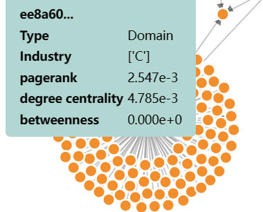

# 前端说明

## 力导引图部分

- 选择框：选择不同的Group
- 自定义参数滑动框
  - `x_offset ` 图中心向右偏移像素值
  - `y_offset` 图中心向下偏移像素值
  - `strength` 决定力强度
  - `linkDistance` 
  - `alphaDecay` 控制模拟的冷却速率

- `Show core path` 按钮：点击突出显示关键路径，将其他节点和边的透明度降低

- 节点tool tip

  

  

  

  