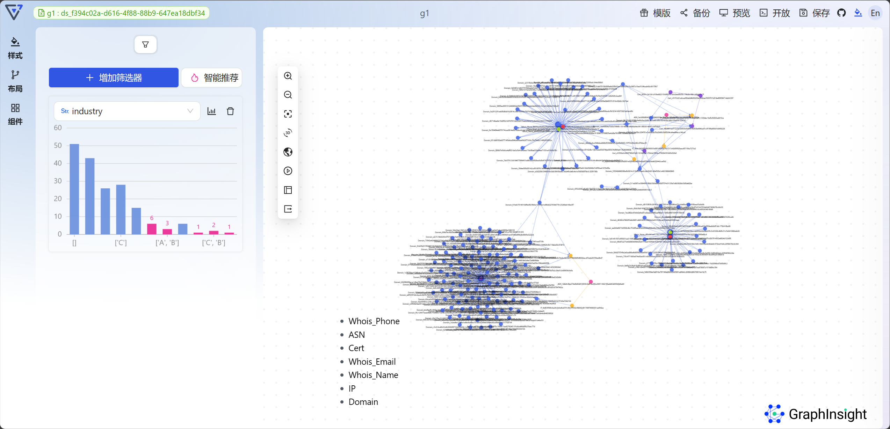
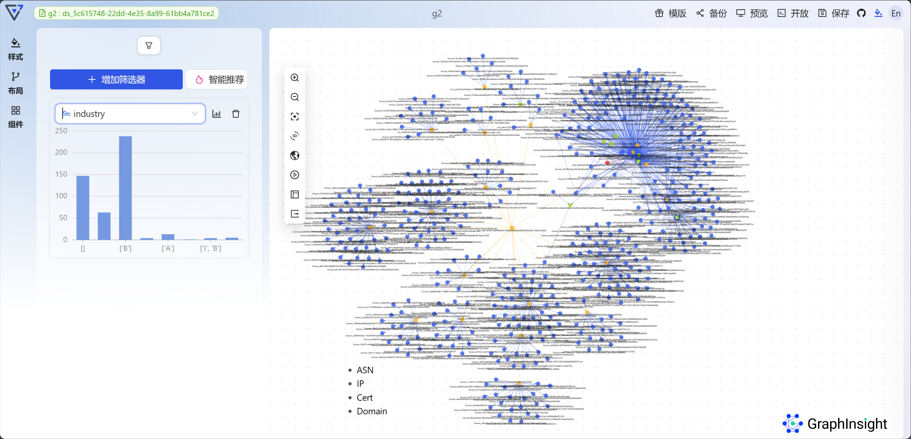
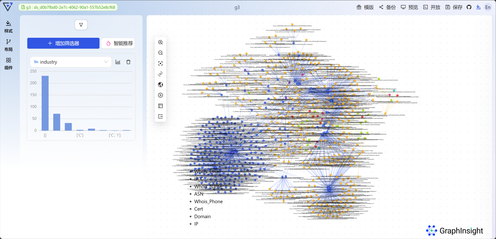
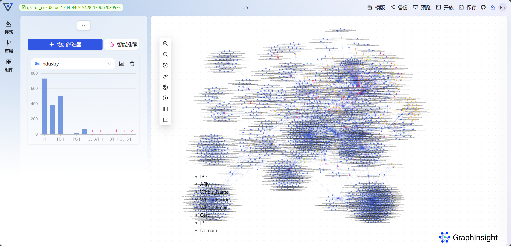
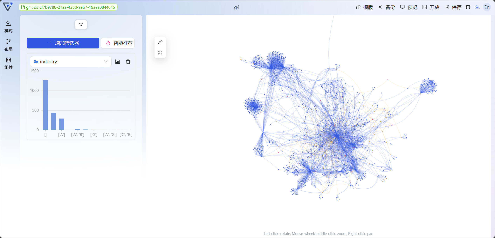

# 后端处理说明

## 数据文件夹说明

路径 `main\data`

原始数据 `Node.csv`, `Link.csv` 应该放在该路径下。（这两个文件未被添加到 repo 中）

- `answer` 
  
  - `total.csv` 汇总了对每个子图的节点数和边数的统计
  - `node_type.csv` 统计了每个子图的节点类型
  - `link_type.csv` 统计了每个子图的边类型
  - 子文件夹中存放的是每个子图的**节点**和**边**的csv文件（与原始数据格式相同，不带额外属性）以及相应的**核心资产**和**关键链路**
  
- `communities` 存放了对原始图进行社区检测的结果，一共891个 community。存放的数据为节点集

- `community_subgraphs` 每个社区节点集对应的子图

- `subgraph` 每个文件是：以单个团伙所有线索为起点，在原始数据中搜索一定跳数内的节点，再经过一定的筛选得到的子图。（看作无向图是连通的）
  
  - 按业务规则
  
    - 如果某个网络资产50%以上的邻边关联强度较弱，则该资产不被认为是核心网络资产
    - 同时关联2个以上IP地址的Domain网络资产很大概率使用了内容分发网络。因此，Domain网络资产所关联的多个IP地址不被认为是核心网络资产
  
    初步判断了是否为核心资产

## 子图挖掘说明

### 子图挖掘

按节点重要性和边重要性选择不同的挖掘深度，具体跳数如下表

| 节点重要性得分 \ 边重要性得分 |  1   |  2   |  3   |  4   |
| :---------------------------: | :--: | :--: | :--: | :--: |
|               4               |  0   |  1   |  2   |  3   |
|               3               |  0   |  1   |  2   |  3   |
|               2               |  0   |  1   |  2   |  2   |
|               1               |  0   |  0   |  2   |  2   |

### 子图筛选

筛选参数

|             参数名              |                             说明                             |
| :-----------------------------: | :----------------------------------------------------------: |
|        `countThreshold`         |       对应 **子图挖掘业务规则 4** 中**成百上千**的阈值       |
|       `countKeepPercent`        |          保留同类型邻居节点（关联关系亦相同）的比例          |
|       `pagerankQuantile`        | `pr_quantile = np.quantile(list(pr.values()), pagerankQuantile)` eg: `pagerankQuantile=0.9`，则`pr_quantile`为0.9分位数 |
|   `degreeCentralityQuantile`    |                                                              |
|        `degreeQuantile`         |                                                              |
| `emptyIndustryPercentThreshold` |                                                              |

1. 统计每个节点同类型邻居节点的比例，如果同类型节点数超过 `countThreshold`，按度排序，保留前 `countKeepPercent` 的节点
2. 计算`pagerankQuantile degreeCentralityQuantile`分位数。遍历节点集，如果该节点周围的**合法**（指有非空 industry 的domain类型节点）邻居节点占比超过`emptyIndustryPercentThreshold` 则保留，否则，若其`pr`和`dc`小于分位数，则将该节点移除。
3. 取极大连通子图
4. 计算 `degreeQuantile` 分位数。遍历节点集，如果该节点**非法**（空industry的domain类型节点）且度小于分位数，且其邻居节点中度大于分位数的节点数少于2，则将该节点移除
5. 取极大连通子图
6. 计算 `bc dc pr` 

### 节点属性

| abbr |                全称                 |                           具体含义                           |
| :--: | :---------------------------------: | :----------------------------------------------------------: |
| `dc` |   degree_centrality （度中心性）    | 指一个节点在网络中的边（link）的数量，这个数量会被归一化，即除以该节点可能拥有的最大边的数量（这个数量是 n-1，其中 n 是网络中的总节点数）。 |
| `bc` | betweenness_centrality (介数中心性) | 指网络中任意两个节点之间的最短路径中，经过该节点的路径数量。 |
| `pr` |              pagerank               | [PageRank -(wikipedia.org)](https://zh.wikipedia.org/wiki/PageRank) |

## 子图挖掘结果

| g1   | g2   |
| ---- | ---- |
| g3   | g5   |

|  |  |
| :-------------------------------------: | :-------------------------------------: |
|  |  |

g4(3D图)

## 核心资产 & 关键链路

### 核心资产

考虑在 **平行坐标图** 中刷选选取

> 目前的做法：按各项指标 `pr` `bc` `dc` 之和选取了得分前10的节点

### 关键链路

前端将刷选到的节点发送到后端，根据所给节点计算关键链路发送回前端

